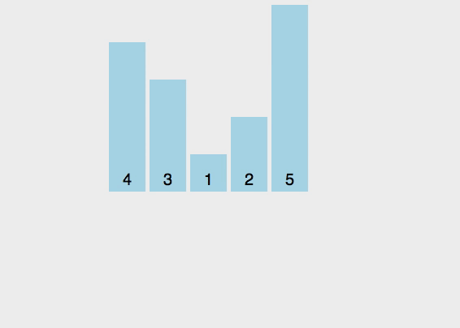

Bubble sort algorithm is one of the slowest algorithms with O(n<sup>2</sup>) time complexity. In nearly sorted data bubble sort algorithm takes `O(n)` time.

If you don't know about Big O notation and logarithms then please check out my previous tutorials.

- [Intro to Big O](/bigo-introduction/)
- [Intro to Logarithms](/logarithms/)

## How to implement bubble sort?

In bubble sort algorithm, we need to compare the adjacent elements.If the adjacent elements are in
wrong order then we need to swap them until every element is sorted in correct order.




### Algorithm implementation

```js
function bubbleSort(arr, length = arr.length) {
    while (length) {
        for (let i = 0; i < arr.length; i++) {
            if (arr[ i ] > arr[i + 1]) {
                let temp = arr[ i ];
                arr[ i ] = arr[i + 1];
                arr[i + 1] = temp
            }
        }
        length--;
    }
    return arr;
}

console.log(bubbleSort([3,9,2,29,1]))

// output - >  [1, 2, 3, 9, 29]

```

In the above code, we are comparing the adjacent elements in the array if the first element is greater than the second element we swapped it.

### Bubble sort implementation using JavaScript map method


```js
function bubbleSort(arr) {
    arr.map(e1 => arr.map((e2, i) => {
        if (arr[ i ] > arr[i + 1]) {
            arr[ i ] = arr[i + 1];
            arr[i + 1] = e2;
        }
    }))
    return arr
}
```

The modified version using array destructuring.

```js
function bubbleSort(arr) {
    arr.map(e1 => arr.map((e2, i) => {
        if (arr[ i ] > arr[i + 1]) { // comparing adjacent elements
           [arr[ i ],arr[i+1]]= [arr[i+1],arr[ i ]]  // swapping
        }
    }))
    return arr
}
```
