In this tutorial, we are going to  build a blazing speed gatsby blog with the
seo,tags and many more.


[View Demo](http://gatsby-advanced-blog.surge.sh/)

Table of contents.
- [Introduction to Gatsby](#introduction)
- [Getting started with Gatsby](#getting-started-with-gatsby)
- [Adding blog posts](#adding-blog-posts)
- [Display the posts list](#display-the-posts-list)
- [Creating the template for the blog posts](#creating-the-template-for-the-blog-posts)
- [Adding images](#adding-images-to-the-post)
- [Prev and next links](#prev-and-next-links)
- [Tags](#tags)
- [Seo in Gatsby](#seo-in-gatsby)
- [Share icons](#share-icons)
- [Bonus](#bonus)

## Introduction

### What is a Gatsby.js?

- Gatsby.js is a static site generator for the react by using Gatsby we can build
any type of modern web apps.

- The sites built with Gatsby are high performant and blazing speed.

- Gatsby.js does the code splitting out of the box so that user can only download required data related to that page.


### Why Gatsby?

- Gatsby has a rich plugin ecosystem.
- Future proof Jamstack websites.
- Everything is static.
- Code splitting out of the box.
- High performance.
- Secured
- Easy to deploy.

## Getting started with Gatsby

 Let's set up a development environment for the blog we are building.


>Nodejs is required for this project if you don't have nodejs then go to nodejs.org and download the version which suits for your operating system. Once you installed then open your terminal and run node --v if the version number is shown then you are successfully installed.


*Note: If you stuck in the middle of this tutorial, please refer to the [Code repository](https://github.com/saigowthamr/gatsby-advanced-starter)*.


Open your terminal and run below commands

```bash
npm install --global gatsby-cli
```

If you are using a mac then you need use **sudo** before the npm.

```bash
sudo npm install --global gatsby-cli
```

Once you successfully completed the above steps; now run the below command to download the gatsby default starter.

```bash
gatsby new myblog
```

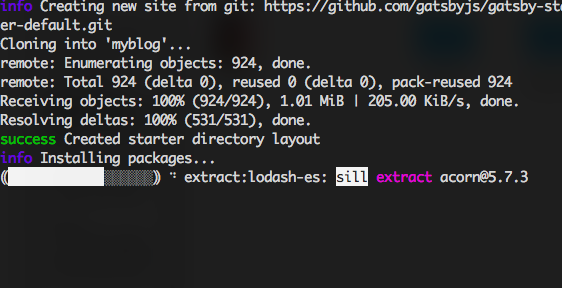


change your current folder to the `myblog` folder by using below commands.

```bash
cd myblog
gatsby develop
```
`gatsby develop` is used to start the local development server by default gatsby uses the port 8000.

Now open your browser and type `localhost:8000` you will see a gatsby index page.


Open the `myblog` folder in your favorite code editor.

Folder structure might look like these.

 


**node_modules**: The packages we are installed using the npm will live in a node_modules folder.

**src**: Main code lives in the src folder.

**gatsby-browser.js**: This file is related to the usage of any browser-related APIs provided by the gatsbyjs.

**gatsby-node.js** This file is related to the usage of any node related APIs provided by the gatsbyjs.

**package.json**: It shows which packages we are currently used in the project.


### Adding blog posts

It's time to create our first blog post with the help of Markdown.

Create a new folder called content As i showed in the below image.

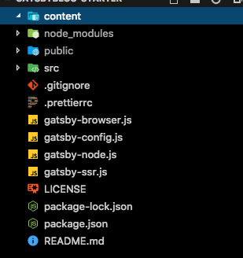


1. Create a `my-firstpost/index.md` folder inside the `content` directory and
add the below content.


```markdown:title=my-firstpost/index.md
---
title: My first Blog post
description: This post is related to the gatsbyjs
date: '2018-12-2'
image: ''
tags: ['javascript','react','gatsby']
---

## Why do we use it?

It is a long established fact that a reader will be distracted by the readable content of a page when looking at its layout. The point of using Lorem Ipsum is that it has a more-or-less normal distribution of letters, as opposed to using 'Content here, content here', making it look like readable English. Many desktop publishing packages and web page editors now use Lorem Ipsum as their default model text, and a search for 'lorem ipsum' will uncover many web sites still in their infancy. Various versions have evolved over the years, sometimes by accident, sometimes on purpose (injected humor and the like).

```

we need to query this Markdown data by using the graphql for that first we need to install the two new plugins which help us to transform the Markdown data into the html format.

 - gatsby transformer remark.
 - gatsby-source-filesystem

```bash
npm install  gatsby-transformer-remark
npm install  gatsby-source-filesystem
```

Now we need to tell the Gatsby to use this two plugins.

Update your `gatsby-config.js` file with the below configuration.


```js:title=gatsby-config.js
module.exports = {
  siteMetadata: {
    title: 'Myblog - reactgo',
  },
  plugins: [
    'gatsby-plugin-react-helmet',
    {
      resolve: `gatsby-plugin-manifest`,
      options: {
        name: 'gatsby-starter-default',
        short_name: 'starter',
        start_url: '/',
        background_color: '#663399',
        theme_color: '#663399',
        display: 'minimal-ui',
        icon: 'src/images/gatsby-icon.png', // This path is relative to the root of the site.
      },
    },
    `gatsby-transformer-remark`,
    'gatsby-plugin-offline',
    {
      resolve: `gatsby-source-filesystem`,
      options: {
        path: `${__dirname}/content`,
        name: "pages",
      },
    },
  ],
}
```
2. Querying the blog data using `GraphiQL`.

Restart your server by hitting `ctrl+c` and run `gatsby develop`, Open your browser and type `http://localhost:8001/___graphql` and copy the below query and paste it on the left side and
hit the play button.


```gql
{
  allMarkdownRemark{
    edges{
      node{
        frontmatter{
           title
            date
           tags
        }
      }
    }
  }
}
```


Have you seen the same data which we just added inside the `myfirstpost/index.md` file.


Next, we need to add a new field to our query which is a slug field. `onCreateNode` API allow us to create the new node fields.


```js:title=gatsby-node.js
const path = require("path")
const { createFilePath, createFileNode } = require(`gatsby-source-filesystem`);

exports.onCreateNode = ({ node, getNode, actions }) => {
    const { createNodeField } = actions
    if (node.internal.type === `MarkdownRemark`) {
        const slug = createFilePath({ node, getNode, basePath: `pages` })
        createNodeField({
            node,
            name: `slug`,
            value: slug,
        })

    }
}
```

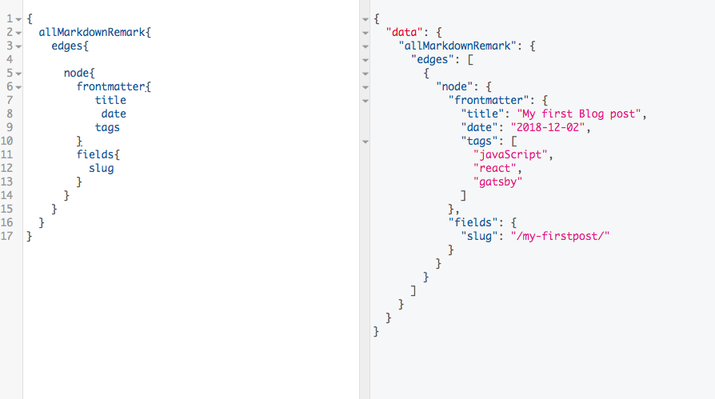

### Display the Posts list

So far we are just querying the data by using GraphiQl, Now we are adding a query inside the `pages/index.js` page so that we can show the available blog posts on the main page of the site.


Open your `pages/index.js` file and add the below data.

```js:title=pages/index.js
import React from 'react'
import { Link, graphql } from 'gatsby'
import './post.css';
import Layout from '../components/layout'

const IndexPage = (props) => {
  const postList = props.data.allMarkdownRemark;
  return (
    <Layout>
      {postList.edges.map(({ node }, i) => (
        <Link to={node.fields.slug} key={i} className="link" >
          <div className="post-list">
            <h1>{node.frontmatter.title}</h1>
            <span>{node.frontmatter.date}</span>
            <p>{node.excerpt}</p>
          </div>
        </Link>
      ))}
    </Layout>
  )
}

export default IndexPage;

export const listQuery = graphql`
  query ListQuery {
    allMarkdownRemark(sort: { order: DESC, fields: [frontmatter___date] }) {
      edges {
        node {
          fields{
            slug
          }
          excerpt(pruneLength: 250)
          frontmatter {
            date(formatString: "MMMM Do YYYY")
            title
          }
        }
      }
    }
  }
`
```
We are sorting the blog posts based on the date.

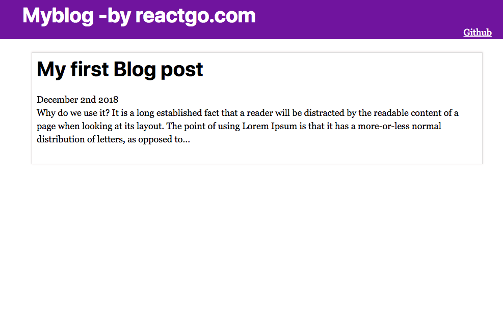

If you try to open that post you will see a broken link because we don't have any templates to handle
the blog-posts.

### Creating the template for the blog posts.


Open the `gatsby-node.js` and replace the code with the below code which helps us to create the pages programmatically by using the same blog post template for the every blog post.


```js:title=gatsby-node.js
const path = require("path")
const { createFilePath, createFileNode } = require(`gatsby-source-filesystem`)

exports.createPages = ({ actions, graphql }) => {
    const { createPage } = actions

    const blogPostTemplate = path.resolve(`src/templates/blog-post.js`)

    return new Promise((resolve, reject) => {

        resolve(graphql(`
    {
      allMarkdownRemark(
        sort: { order: DESC, fields: [frontmatter___date] }
        limit: 1000
      ) {
        edges {
          node {
              fields{
                  slug
              }
            frontmatter {
              title
            }
          }
        }
      }
    }
  `).then(result => {
                if (result.errors) {
                    console.log(result.errors)
                    return reject(result.errors)
                }

                const blogTemplate = path.resolve('./src/templates/blog-post.js');

                result.data.allMarkdownRemark.edges.forEach(({ node }) => {
                    createPage({
                        path: node.fields.slug,
                        component: blogTemplate,
                        context: {
                            slug: node.fields.slug,
                        }, // additional data can be passed via context
                    })
                })
                return
            })
        )
    })
}


exports.onCreateNode = ({ node, getNode, actions }) => {
    const { createNodeField } = actions
    if (node.internal.type === `MarkdownRemark`) {
        const slug = createFilePath({ node, getNode, basePath: `pages` })
        createNodeField({
            node,
            name: `slug`,
            value: slug,
        })

    }
}
```

Let's create a blog post template.


```js:title=templates/blog-post.js
import React from 'react';
import Layout from '../components/layout';

function BlogPost() {
    return (
        <Layout>
            <div>
                hello post
        </div>
        </Layout>
    )
}

export default BlogPost
```


Now delete `.cache` folder and run the `gatsby develop`

If you navigate over to the `localhost:8000/my-fristpost` you will see a Blog post template is rendered on the screen.

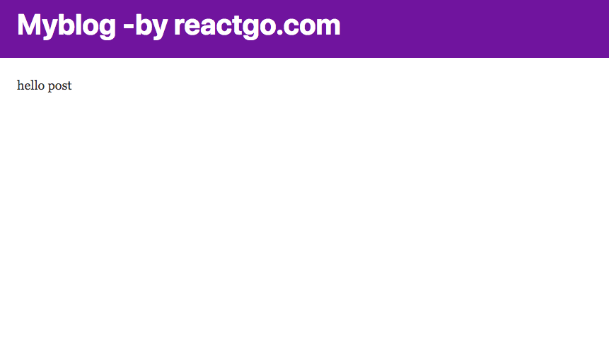


- Update the `blog-post.js` template by adding a query.
- The data of this query is available to us in `props.data`.

```js:title=templates/blog-post.js


import React from 'react';
import Layout from '../components/layout';
import { graphql } from 'gatsby'

function BlogPost(props) {

    const post = props.data.markdownRemark;
    const { title,date } = post.frontmatter;

    return (
        <Layout>
            <div>
                <h1>{title}</h1>
                <div dangerouslySetInnerHTML={{ __html: post.html }} />
            </div>
        </Layout>
    )
}


export default BlogPost;

export const query = graphql`

query PostQuery($slug: String!) {
    markdownRemark(fields: { slug: { eq: $slug } }) {
        html
        excerpt
        frontmatter {
            title
        }
    }
}`

```


Let's add a second post to our blog `second-post/index.md` inside the `content` directory.


```markdown:title=second-post/index.md
---
title: My second Blog post
date: '2018-12-02'
image: ''
tags: ['javascript','react']
---

Lorem Ipsum is simply dummy text of the printing and typesetting industry.
Lorem Ipsum has been the industry's standard dummy text ever since the 1500s when an unknown printer took a galley of type and scrambled it to make a type
specimen book. It has survived not only five centuries, but also the leap into
electronic typesetting, remaining essentially unchanged. It was popularised in
the 1960s with the release of Letraset sheets containing Lorem Ipsum passages,
and more recently with desktop publishing software like Aldus PageMaker
including versions of Lorem Ipsum.

## Why do we use it?

It is a long established fact that a reader will be distracted by the
readable content of a page when looking at its layout. The point of using
Lorem Ipsum is that it has a more-or-less normal distribution of letters,
as opposed to using 'Content here, content here', making it look like readable
English. Many desktop publishing packages and web page editors now use Lorem Ipsum
as their default model text, and a search for 'lorem ipsum' will uncover many web
sites still in their infancy. Various versions have evolved over the years, sometimes
by accident, sometimes on purpose (injected humor and the like).

```
Restart the development server you will see two posts on the index page.

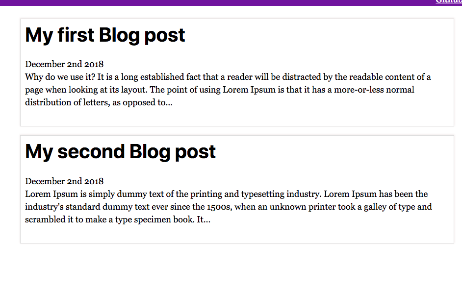


### Adding images to the post

Gatsby offers us a different type of plugins to lazy load the images by adding a blur effect and also crop the images for the different device sizes.

It helps us to load the pages fastly.


**How to add images to our blog?**

we need to install the three plugins which are 'transformer-sharp', 'plugin-sharp,gatsby-image'.

Run the below commands to install the three plugins.

```bash
npm install --save gatsby-transformer-sharp gatsby-plugin-sharp
npm install --save gatsby-image
```

Let's add an image to our blog post.


```md:title=my-firstpost/index.md
---
title: My first Blog post
description: This post is related to the gatsbyjs
date: '2018-09-26'
image: time.jpg
---
```
time.jpg is present inside the `my-firstpost`  folder.


we need to add a query for that image inside the *blog-post.js* template.


```js:title=templates/blog-post.js

import React from 'react';
import Layout from '../components/layout';
import Img from 'gatsby-image';
import { graphql } from 'gatsby'

function BlogPost(props) {

    const post = props.data.markdownRemark;
    const { title} = post.frontmatter;

    return (
        <Layout>
            <div>
                <h1>{title}</h1>
                
                <div dangerouslySetInnerHTML={{ __html: post.html }} />
            </div>
        </Layout>
    )
}


export default BlogPost

export const query = graphql`

 query PostQuery($slug: String!) {
     markdownRemark(fields: { slug: { eq: $slug } }) {
       html
       excerpt
       frontmatter {
        title
        image {
          childImageSharp {
            resize(width: 1500, height: 1500) {
              src
            }
            fluid(maxWidth: 786) {
              ...GatsbyImageSharpFluid
            }
          }
       }
       }
   }
}
`
```

Gatsby transformer sharp and plugin sharp are used to processing the images and produce the responsive images.


restart your development server you will see an image with the blur effect and faster load timing.


### Prev and Next Links

Let's add the previous post links and next post links  at the bottom of the every
post so that users can easily navigate to the next post or prev post.

Update the `gatsby-config.js` with the prev and next links

```js:title=gatsby-config.js
const path = require('path')
const { createFilePath, createFileNode } = require(`gatsby-source-filesystem`)


exports.createPages = ({ actions, graphql }) => {
    const { createPage } = actions

    return new Promise((resolve, reject) => {
        resolve(
            graphql(`
        {
          allMarkdownRemark(
            sort: { order: DESC, fields: [frontmatter___date] }
            limit: 1000
          ) {
            edges {
              node {
                fields {
                  slug
                }
                frontmatter {
                  title
                }
              }
            }
          }
        }
      `).then(result => {
                    if (result.errors) {
                        console.log(result.errors)
                        return reject(result.errors)
                    }

                    const blogTemplate = path.resolve('./src/templates/blog-post.js')
                    const posts = result.data.allMarkdownRemark.edges
                    posts.forEach(({ node }, index) => {
                        createPage({
                            path: node.fields.slug,
                            component: blogTemplate,
                            context: {
                                slug: node.fields.slug,
                                prev: index === 0 ? null : posts[index - 1],
                                next: index === result.length - 1 ? null : posts[index + 1],
                            }, // additional data can be passed via context
                        })
                    })
                    return
                })
        )
    })
}

exports.onCreateNode = ({ node, getNode, actions }) => {
    const { createNodeField } = actions
    if (node.internal.type === `MarkdownRemark`) {
        const slug = createFilePath({ node, getNode, basePath: `pages` })
        createNodeField({
            node,
            name: `slug`,
            value: slug,
        })
    }
}

```

Anything we passed inside the `context` object can be available inside every post as a
`props.pageConext`.


Let's create a new component for handling the prev and next links.


```js:title=prevnext.js

import React from 'react'
const PrevNext = (props) => {

    const { prev, next } = props

    return (
        <ul>
            {prev && <li><a href={prev.fields.slug}>
                Previous {" "}
                {prev.frontmatter.title}</a></li>}
            {next && <li><a href={next.fields.slug}>
                Next  {" "} {next.frontmatter.title}

            </a></li>}
        </ul>
    )
}

export default PrevNext;

```

import that new component to the `blog-post.js` and update the
`blog-post.js` with the below code.


```js:title=templates/blog-post.js
import React from 'react';
import Layout from '../components/layout';
import Img from 'gatsby-image';
import { graphql } from 'gatsby'
import PrevNext from '../components/prevnext';

function BlogPost(props) {

    const { title, image } = props.data.markdownRemark.frontmatter;
    const { prev, next } = props.pageContext;

    return (
    <Layout>
        <div>
            <h1>{title}</h1>
            {image && }

            <div dangerouslySetInnerHTML={{ __html: props.data.markdownRemark.html }} />

            <PrevNext prev={prev && prev.node} next={next && next.node} />
        </div>
    </Layout>
    )
}


export default BlogPost

export const query = graphql`

 query PostQuery($slug: String!) {
    markdownRemark(fields: { slug: { eq: $slug } }) {
       html
       excerpt
       frontmatter {
        title
        image {
          childImageSharp {
            resize(width: 1000, height: 420) {
              src
            }
            fluid(maxWidth: 786) {
              ...GatsbyImageSharpFluid
            }
          }
        }
       }
   }
}
`
```


Now, delete `.cache` folder and restart your development server.


### Tags

Tags help us to display the available posts on that particular tag so that users can browse
the related content.

Let's create a new template called `tag-template.js`.

```js:title=templates/tag-template.js

import React from 'react';
import { Link, graphql } from 'gatsby'
import Layout from '../components/layout';
import '../pages/post.css'

function Tags(props) {
    const posts = props.data.allMarkdownRemark.edges;
    const { tag } = props.pageContext;
    return (
        <Layout>
            <h1>{`Available posts  in ${tag}`}</h1>
            <div className="tags">
                {
                    posts.map(({ node }, i) => (
                        <Link to={node.fields.slug} key={i} >
                            {node.frontmatter.title}
                        </Link>
                    ))
                }
            </div>
        </Layout>
    )
}


export default Tags;


export const query = graphql`

 query TagsQuery($tag: String!) {
allMarkdownRemark(
      limit: 2000
      sort: { fields: [frontmatter___date], order: DESC }
      filter: { frontmatter: { tags: { eq: $tag } } }
    ) {
      edges {
        node {
          frontmatter {
            title
          }
          fields {
            slug
          }
        }
      }
    }
}
`
```

Now we need to update the `gatsby-node.js` to use this template.

we are using the lodash to get the unique tags from the allPosts and programmatically creating
pages for each tag.

```js:title=gatsby-node.js
const path = require('path')
const { createFilePath, createFileNode } = require(`gatsby-source-filesystem`)
const _ = require('lodash');

exports.createPages = ({ actions, graphql }) => {
    const { createPage } = actions

    return new Promise((resolve, reject) => {
        resolve(
            graphql(`
        {
          allMarkdownRemark(
            sort: { order: DESC, fields: [frontmatter___date] }
            limit: 1000
          ) {
            edges {
              node {
                fields {
                  slug

                }
                frontmatter {
                  title
                  tags
                }
              }
            }
          }
        }
      `).then(result => {
                    if (result.errors) {
                        console.log(result.errors)
                        return reject(result.errors)
                    }

   const posts = result.data.allMarkdownRemark.edges
   const blogTemplate = path.resolve('./src/templates/blog-post.js');
   const tagsTemplate = path.resolve('./src/templates/tag-template.js');

                    //All tags
                    let allTags = []
        // Iterate through each post, putting all found tags into `allTags array`
             _.each(posts, edge => {
            if (_.get(edge, 'node.frontmatter.tags')) {
                 allTags = allTags.concat(edge.node.frontmatter.tags)
             }
          })
                    // Eliminate duplicate tags
            allTags = _.uniq(allTags)

            allTags.forEach((tag, index) => {
                createPage({
                 path: `/${_.kebabCase(tag)}/`,
                component: tagsTemplate,
                context: {
                    tag,
                    }
                })
                })

            posts.forEach(({ node }, index) => {
                createPage({
                path: node.fields.slug,
                component: blogTemplate,
                context: {
                slug: node.fields.slug,
                prev: index === 0 ? null : posts[index - 1],
                next: index === result.length - 1 ? null : posts[index + 1],
                 },
               })
             })
            return
        })
        )
    })
}

exports.onCreateNode = ({ node, getNode, actions }) => {
    const { createNodeField } = actions
    if (node.internal.type === `MarkdownRemark`) {
        const slug = createFilePath({ node, getNode, basePath: `pages` })
        createNodeField({
            node,
            name: `slug`,
            value: slug,
        })
    }
}


```

**Display the tags**

Let's create one more page called `tags.js` which helps us to show the available tags.


```js:title:pages/tags.js

import React from 'react';
import { Link, graphql } from "gatsby"
import Layout from '../components/layout';
import './post.css'

function TagsPage(props) {

    const data = props.data.allMarkdownRemark.group

    return (
        <Layout>
            <div className="tags">
                <h1>All tags</h1>
                {
                    data.map(tag => (
                        <Link to={`/${tag.fieldValue}`} >
                            {tag.fieldValue} {`(${tag.totalCount})`}
                        </Link>
                    ))
                }
            </div>
        </Layout>
    )

}

export default TagsPage;


export const pageQuery = graphql`
  query {
    allMarkdownRemark(
      limit: 2000) {
      group(field: frontmatter___tags) {
        fieldValue
        totalCount
      }
    }
  }

`
```
Now, open your browser and navigate to `localhost:8000/tags` you can see all available tags
which we added at the time of creating a blog post.


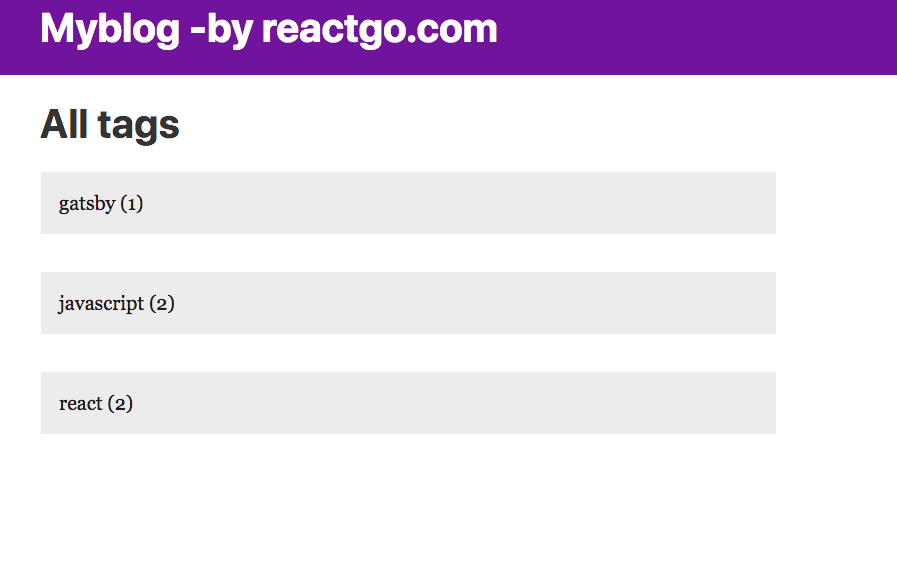

If you click any of those tags, you can see the available posts in that particular tag.

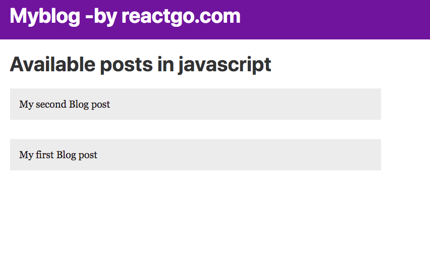

### Seo in gatsby

Search engine optimization is very important to every site it's bad behavior if we show the same title and description on every page of our site. we are using the `react helmet library` to control the meta tags in our pages.

Let's create a new component for handling the meta tags so that we can reuse it whenever it's is required.

Create a new file called `Metatags.js` in your components folder.


```js:title=components/Metatags.js
import React from 'react';
import Helmet from 'react-helmet'

function Metatags(props) {

    return (
        <Helmet
            title={props.title}
            meta={[
                { name: 'title', content: props.title },

                { name: 'description', content: props.description },
                {
                    property: 'og:title',
                    content: props.title,
                },
                {
                    property: 'og:url',
                    content: props.pathname ? props.url + props.pathname : props.url,
                },

                {
                    property: 'og:image',
                    content: props.thumbnail && props.thumbnail,
                },
                {
                    property: 'og:image:secure_url',
                    content: props.thumbnail && props.thumbnail,
                },

                {
                    property: 'og:description',
                    content: props.description,
                },

                {
                    property: 'og:image:width',
                    content: '1200',
                },

                {
                    property: 'og:image:height',
                    content: '630',
                },
                {
                    property: 'og:locale',
                    content: 'en',
                },
                { name: 'twitter:card', content: 'summary_large_image' },

                { name: 'twitter:title', content: props.title },

                {
                    name: 'twitter:description',
                    content: props.description,
                },
                {
                    name: 'twitter:image',
                    content: props.thumbnail && props.thumbnail,
                },
                { property: 'og:type', content: 'website' },
                { name: 'robots', content: 'index, follow' },

                { name: 'twitter:creator', content: '@saigowthamr' },
                { property: 'og:site_name', content: 'yoursitename' }
            ]}
        >
            <html lang="en" />
        </Helmet>
    )
}

export default Metatags;
```


Now we are ready to use this `Metatags` component inside the BlogPost template.


```js:title=templates/blog-post.js
import React from 'react';
import Layout from '../components/layout';
import Img from 'gatsby-image';
import { graphql } from 'gatsby'
import PrevNext from '../components/prevnext';
import MetaTags from '../components/Metatags';


function BlogPost(props) {

    const url = props.data.site.siteMetadata.siteUrl
    const thumbnail = props.data.markdownRemark.frontmatter.image &&
          props.data.markdownRemark.frontmatter.image.childImageSharp.resize.src
    const { title, image } = props.data.markdownRemark.frontmatter;
    const { prev, next } = props.pageContext;

    return (
        <Layout>
            <MetaTags
                title={title}
                description={props.data.markdownRemark.excerpt}
                thumbnail={thumbnail && url + thumbnail}
                url={url}
                pathname={props.location.pathname}
            />
            <div>
                <h1>{title}</h1>
                {image && }
          <div dangerouslySetInnerHTML={{ __html: props.data.markdownRemark.html }} />
                <PrevNext prev={prev && prev.node} next={next && next.node} />
            </div>
        </Layout>
    )
}


export default BlogPost

export const query = graphql`

 query PostQuery($slug: String!) {
    markdownRemark(fields: { slug: { eq: $slug } }) {
       html
       excerpt
       frontmatter {
        title
        image {
          childImageSharp {
            resize(width: 1000, height: 420) {
              src
            }
            fluid(maxWidth: 786) {
              ...GatsbyImageSharpFluid
            }
          }
        }
       }
   }
   site {
    siteMetadata {
        siteUrl
      }
   }
}
`
```

Let's test it now by using Mozilla dev tools.

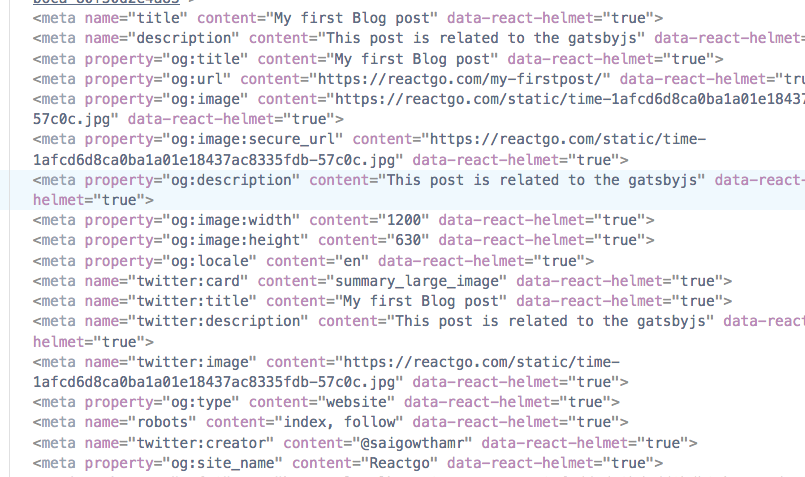


### Share Icons

Let's add the share icons to our blog post so that anyone can easily share our posts on
the social media.


Create a new component called `share.js` inside the components folder.

```js:title=components/share.js
import React from 'react'
import twitterIcon from '../images/twitter.png'
import fbIcon from '../images/facebook.png'
import './share.css'

const Share = props => {

    const twitter = `https://twitter.com/intent/tweet?url=${props.url +
        props.pathname}&text=${props.title} by @saigowthamr`;

    const fb = `https://www.facebook.com/sharer/sharer.php?u=${props.url +
        props.pathname}`;

    return (
        <div>
            <h3 className="center">Share</h3>
            <ul className="social">
                <li>
                    <a href={fb} target="blank">
                        
                    </a>
                </li>
                <li>
                    <a href={twitter} target="blank">
                        
                    </a>
                </li>
            </ul>
        </div>
    )
}

export default Share;
```


import the `share.js` component inside the `blog-post.js`.


```js:title=templates/blog-post.js
import React from 'react';
import Layout from '../components/layout';
import Img from 'gatsby-image';
import { graphql } from 'gatsby'
import PrevNext from '../components/prevnext';
import MetaTags from '../components/Metatags';
import Share from '../components/share';

function BlogPost(props) {

    const url = props.data.site.siteMetadata.siteUrl
    const thumbnail = props.data.markdownRemark.frontmatter.image &&
        props.data.markdownRemark.frontmatter.image.childImageSharp.resize.src
    const { title, image } = props.data.markdownRemark.frontmatter;
    const { prev, next } = props.pageContext;

    return (
        <Layout>
            <MetaTags
                title={title}
                description={props.data.markdownRemark.excerpt}
                thumbnail={thumbnail && url + thumbnail}
                url={url}
                pathname={props.location.pathname}
            />
            <div>
                <h1>{title}</h1>
                {image && }
                <div dangerouslySetInnerHTML={{ __html: props.data.markdownRemark.html }} />
                <Share title={title} url={url} pathname={props.location.pathname} />
                <PrevNext prev={prev && prev.node} next={next && next.node} />
            </div>
        </Layout>
    )
}


export default BlogPost

export const query = graphql`

 query PostQuery($slug: String!) {
    markdownRemark(fields: { slug: { eq: $slug } }) {
       html
       excerpt
       frontmatter {
        title
        image {
          childImageSharp {
            resize(width: 1000, height: 420) {
              src
            }
            fluid(maxWidth: 786) {
              ...GatsbyImageSharpFluid
            }
          }
        }
       }
   }
   site {
    siteMetadata {
        siteUrl
      }
   }
}
`
```


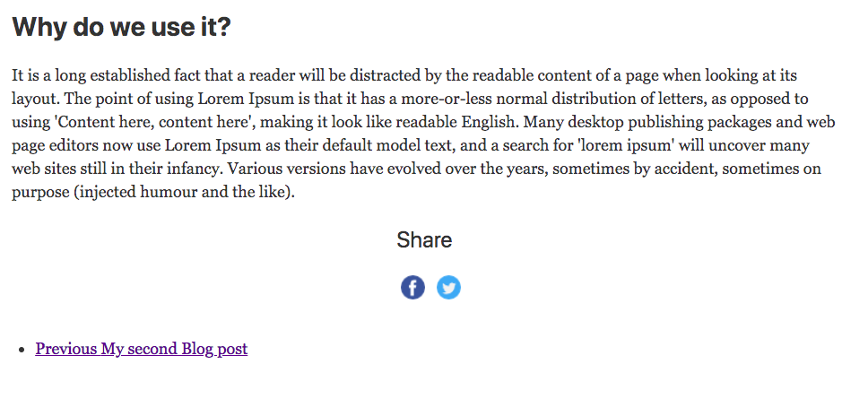


### Bonus


1. Sitemaps in gatsby.

Gatsby has a plugin to generate the siteMaps based on the site content.

install a plugin called `gatsby-plugin-sitemap`.

```bash
npm install --save gatsby-plugin-sitemap
```

Update the `gatsby-config.js` with this new plugin.


```js
module.exports = {
  siteMetadata: {
    title: 'Myblog -by reactgo.com',
    siteUrl: 'https://reactgo.com',
  },
  plugins: [
    'gatsby-plugin-react-helmet',
    `gatsby-plugin-sharp`,
    `gatsby-transformer-sharp`,
    `gatsby-plugin-sitemap`,
    {
      resolve: `gatsby-plugin-manifest`,
      options: {
        name: 'gatsby-starter-default',
        short_name: 'starter',
        start_url: '/',
        background_color: '#663399',
        theme_color: '#663399',
        display: 'minimal-ui',
        icon: 'src/images/gatsby-icon.png', // This path is relative to the root of the site.
      },
    },
    `gatsby-plugin-catch-links`,
    'gatsby-plugin-offline',
    {
      resolve: `gatsby-transformer-remark`,
      options: {
        plugins: [
          `gatsby-remark-prismjs`,
        ]
      }
    },
    {
      resolve: `gatsby-source-filesystem`,
      options: {
        path: `${__dirname}/content`,
        name: "pages",
      },
    },
  ],
}

```
>Note: The generated sitemaps will available at /sitemap.xml


#### Tags  added to  the each post

We need to add a one more field to the BlogPost query inside the `blog-post.js`

```js:title=templates/blog-post.js
import React from 'react';
import Layout from '../components/layout';
import Img from 'gatsby-image';
import { graphql } from 'gatsby'
import PrevNext from '../components/prevnext';
import MetaTags from '../components/Metatags';
import Share from '../components/share';

function BlogPost(props) {

    const url = props.data.site.siteMetadata.siteUrl
    const thumbnail = props.data.markdownRemark.frontmatter.image &&
        props.data.markdownRemark.frontmatter.image.childImageSharp.resize.src
    const { title, image, tags } = props.data.markdownRemark.frontmatter;
    const { prev, next } = props.pageContext;
    return (
        <Layout>
            <MetaTags
                title={title}
                description={props.data.markdownRemark.excerpt}
                thumbnail={thumbnail && url + thumbnail}
                url={url}
                pathname={props.location.pathname}
            />
            <div>
                <h1>{title}</h1>
                {image && }
                <div dangerouslySetInnerHTML={{ __html: props.data.markdownRemark.html }} />
                <div>
                    <span>Tagged in </span>
                    {tags.map((tag, i) => (
                        <a href={`/${tag}`} key={i} style={{ marginLeft: "10px" }} >{tag}</a>
                    ))}
                </div>
                <Share title={title} url={url} pathname={props.location.pathname} />
                <PrevNext prev={prev && prev.node} next={next && next.node} />
            </div>
        </Layout>
    )
}


export default BlogPost

export const query = graphql`

 query PostQuery($slug: String!) {
    markdownRemark(fields: { slug: { eq: $slug } }) {
       html
       excerpt
       frontmatter {
        title
        tags
        image {
          childImageSharp {
            resize(width: 1000, height: 420) {
              src
            }
            fluid(maxWidth: 786) {
              ...GatsbyImageSharpFluid
            }
          }
        }
       }
   }
   site {
    siteMetadata {
        siteUrl
      }
   }
}
`
```
Now you can see tags are rendered below on each post.

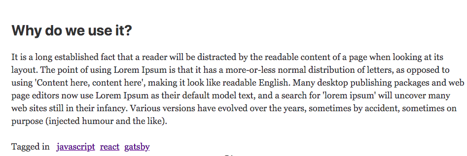

---

- [How to host a gatsby blog](https://reactgo.com/gatsbyblog/hostinggatsbysite/)
- [Code repository](https://github.com/saigowthamr/gatsby-advanced-starter)
- [View Demo ](http://gatsby-advanced-blog.surge.sh/)


Happy coding...