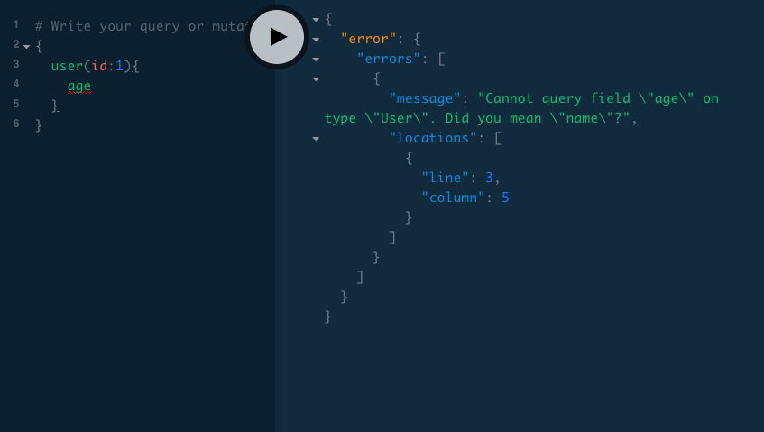
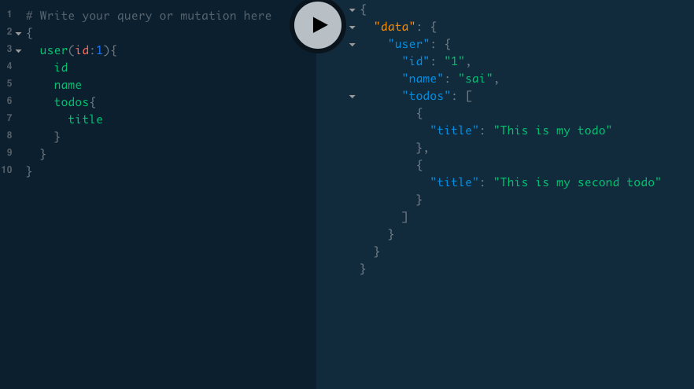

In this tutorial, we are going to learn about resolver functions and query fields in graphql.


First, let's design a  GraphQL Schema.

```js
type User{
    id: ID!
    name: String!
}


type Query{

    user(id:ID!):User

}

```
Our GraphQL schema has `User` type with two fields `id, name` and `Query` type with one field `user`  but so far graphql didn't know how to respond to those queries.

### Resolvers

- Resolvers help us to tell the GraphQL how to respond to those query fields by using resolver functions.

- In graphql, every query field should be backed by there own resolver function.

`fieldName(parent,args,ctx,info)`

```js

const resolvers ={

    Query:{
        user(parent,args,ctx,info){
           console.log('hello')
             return Users.find((user)=> user.id === args.id)
        }
    }
}

```
>Note: Resolver function names should me match with the Query field names in the schema.


Every **resolver function** in GraphQL has four arguments.


`parent or root`: Which helps us to the get parent data if we use nested queries in graphql.

`args`: Arguments are the objects passed at the time of running the query.

`context`: The context data is passed to every resolver function, like authentication or change theme.

`info`: It contains the more depth information about the current query. (Like Ast's mostly used in advanced use cases.)

### What happens when we run a query?


GraphQL first matches the query with the type system if this query is valid then only GraphQL invokes the resolver functions otherwise graphql returns error without invoking the resolver function.

*Invalid query*




*valid query*




happy coding..