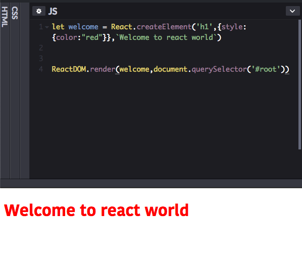
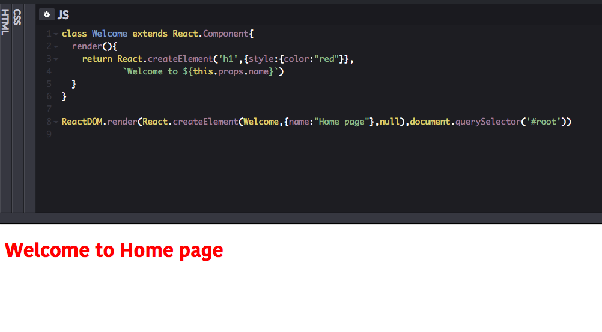

In this tutorial, we are going to learn how to write react without jsx.

The JSX we write inside the react.js is often  transpiled to a React.createElement method with the help of babel compiler.

`React.createElement` method takes the three arguments **type** , **props** ,**children**.


__type__: Type of the html element or component. (example : `h1,h2,p,button`..etc ).

__props__: The properties object.

(example: `{style :{ color:"red"}}, className,event handlers etc` ).

__children__: anything you need to pass between the dom elements.


__Simple example__

```js

let welcome = React.createElement('h1',{style:{color:"red"}},`Welcome to react world`)


ReactDOM.render(welcome,document.querySelector('#root'))

```

**ReactDom.render  method accepts two arguments.**

- The first argument is which component or element needs to render in the dom.

- The second argument is where to render in the dom.



This is a pure JavaScript without using jsx.


Let's refactor the above code by creating a `Welcome` component.


```js

class Welcome extends React.Component{
  render(){
    return React.createElement('h1',{style:{color:"red"}},
            `Welcome to ${this.props.name}`)
  }
}

ReactDOM.render(React.createElement(Welcome,
                {name:"Home page"},null),document.querySelector('#root'))

```

Inside the  `Welcome` Component, we have added the `props`.so that we have passed the props data`{name:"Home page"}` as a second argument.





So far we are building components with no user interaction let's build an interactive component with the state and event Handling.


### Counter component example


```jsx{1,25-30}

const  el =  React.createElement

function Button(props){
  return el('button',{onClick:props.handleClick},props.name)
}

class Counter extends React.Component{

  state= {
       num: 0
  }

  handleIncrement = () =>{
    this.setState({
      num: this.state.num + 1
    })
  }

   handleDecrement = () =>{
    this.setState({
      num: this.state.num - 1
    })
  }


  render(){
    return el('div',null,
                          el(Button,{handleClick:this.handleIncrement,name:'Increment'},null),
                          el(Button,{handleClick:this.handleDecrement,name:'Decrement'},null),
                          el('p',null,this.state.num),
  }

}


ReactDOM.render(el(Counter,null,null),document.querySelector('#root'))
```

**Code pen demo**

<iframe height='265' scrolling='no' title='React.createelement method example' src='//codepen.io/saigowthamr/embed/jXVMZy/?height=265&theme-id=dark&default-tab=result' frameborder='no' allowtransparency='true' allowfullscreen='true' style='width: 100%;'>See the Pen <a href='https://codepen.io/saigowthamr/pen/jXVMZy/'>React.createelement method example</a> by saigowtham (<a href='https://codepen.io/saigowthamr'>@saigowthamr</a>) on <a href='https://codepen.io'>CodePen</a>.
</iframe>


Let's see the same __Counter__ example by using [JSX](/learn-react-jsx-detailed/).


```js
function Button(props) {
  return <button onClick={props.handleClick}>{props.name}</button>
}

class Counter extends React.Component {

  state = {
    num: 0
  }

  handleIncrement = () => {
    this.setState({
      num: this.state.num + 1
    })
  }

  handleDecrement = () => {
    this.setState({
      num: this.state.num - 1
    })
  }

  render() {
    return (
      <div>
        <p>{this.state.num}</p>
        <Button name="Increment" handleClick={this.handleIncrement} />
        <Button name="Decrement" handleClick={this.handleDecrement} />
      </div>

    )
  }
}


ReactDOM.render(<Counter />, document.querySelector('#root'))
```
By using JSX, the code readability increases and also we can create components easily this is  the reason we use jsx in react apps.