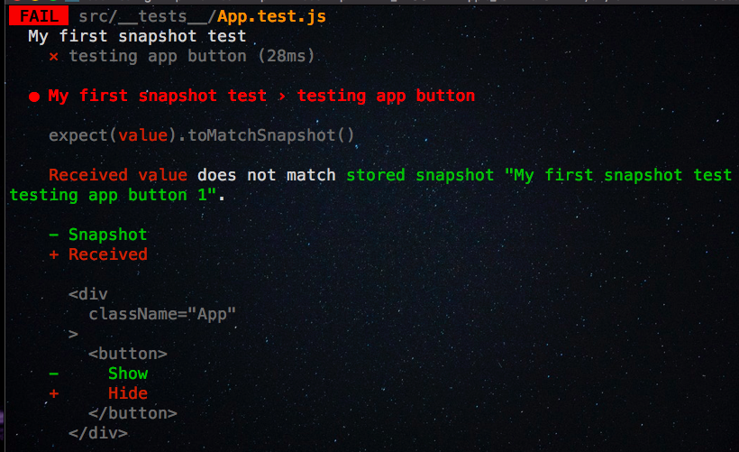
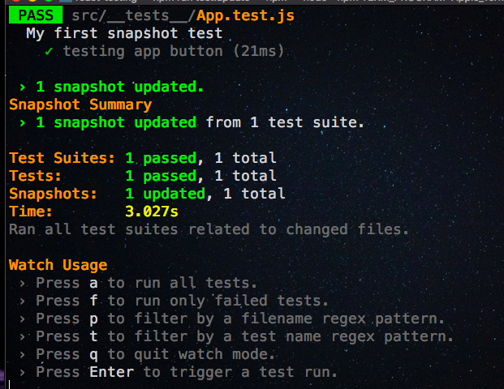

In this tutorial, we are going to learn about how to test react components by using a __jest__ testing framework.

## What is Jest?

Jest is a JavaScript testing framework created by Facebook it works with React, Angular, Vue.


### Getting started

First, we need to  create a new react app by using `create-react-app`
command line tool.

Run the below command to install react app.

```bash
npx create-react-app react-testing
```

This above command will download the react related files in 'react-tesing' folder.

change your current working directory by running following command.

```bash
cd react-testing
```

If we create a new app by using `create-react-app` jest is already included in our react project.

Now open your 'react-testing' folder in your favorite code editor.


create a new folder called `__tests__` in your `src` folder because by default jest looks for `__tests__` folder in your project and runs all __tests__ present inside that folder.


>Delete App.test.js file in your src folder.


Now remove everything present inside your `App.js` file and add the below code.

```js
import React, { Component } from 'react';

class App extends Component {
  render() {
    return (
      <div className="App">
        <button>Show</button>
      </div>
    );
  }
}
export default App;
```

This a simple `App` component with `Show` button.

### Writing Our first Test

Let's write our first snapshot test by using jest.

**What is SnapShot test ?**

 A typical snapshot test case for a react app renders a UI component, takes a snapshot then it checks against the reference snapshot file created by the jest if both snapshots don't match our tests will fail.

We need to install a new package called `react-test-renderer` which helps to grab a snapshot for our component.

```bash
npm i -D react-test-renderer
```

Now create a new file called `App.test.js` in your `__tests__` folder.

```js:title=App.test.js
import React from 'react';
import App from '../App';
import { create } from 'react-test-renderer'

describe('My first snapshot test',()=>{
    test('testing app button', () => {
    let tree = create(<App />)
    expect(tree.toJSON()).toMatchSnapshot();
  })
})
```

In the above code, we have imported our `App` component and `create` method from `react-test-render`
package.

Let's run our test by using below command.

```bash
npm run test
```


This command will create a `snapshots` folder with the snapshot file if we try to change our `button` name to `Hide` in `App` component jest re-runs our test and checks against with previously created snapshot if both snapshots don't match our tests will fail.

Let's make our test fail by changing our `button` name.

```js:title=App.js
import React, { Component } from 'react';

class App extends Component {
  render() {
    return (
      <div className="App">
        <button>Hide</button>
      </div>
    );
  }
}
export default App;
```



Have you seen in above image jest clearly mentioning received value doesn't match with a stored snapshot?

If we need to update the existing snapshot then we need to add a new script to our package.json file.

```json
"test:update": "react-scripts test --updateSnapshot",
```

Let's run below command to update our previously created snapshot.

```js
npm run test:update
```




### Interaction with our component

So far we didn't add any state or methods to our `App` component let's add the state and methods to our Component.

Update your `App.js` file with the below code.

```js
import React, { Component } from 'react';

class App extends Component {

  state = {
    isActive: false
  }

  handleClick = () => {
    this.setState({ isActive: !this.state.isActive })
  }


  render() {
    return (
      <div className="App">
        <button onClick={this.handleClick}>
          {this.props.show ? "Hide" : "Show"}
        </button>
      </div>
    );
  }
}
export default App;
```

Instead of manually changing the `button` name we have added a state to our App component.

Let's use the jest snapshot feature and `react-test-renderer` to interact with our Component and write tests for, is `button` changing its name correctly or not.


```js:title=App.test.js
import React from 'react';
import App from '../App';
import { create, update } from 'react-test-renderer'

describe('My first snapshot test', () => {
    test('testing app button', () => {
        let tree = create(<App />)
        expect(tree.toJSON()).toMatchSnapshot();
    })
})


describe("Changing our button name to Hide", () => {

    test('toggle the button', () => {
        let tree = create(<App />);

        let instance = tree.getInstance();

        expect(instance.state.isActive).toBe(false)

        // changing  the state
        instance.handleClick();

     // isActive property is updated to `true`
        expect(instance.state.isActive).toBe(true);

        expect(tree.toJSON()).toMatchSnapshot()
    })
})
```

Now if you open your snapshot file you will see two snapshots.

```bash
// Jest Snapshot v1, https://goo.gl/fbAQLP


exports[`My first snapshot test testing app button 1`] = `
<div
  className="App"
>
  <button
    onClick={[Function]}
  >
    Show
  </button>
</div>
`;

exports[`Changing our button name to Hide toggle the button 1`] = `
<div
  className="App"
>
  <button
    onClick={[Function]}
  >
    Hide
  </button>
</div>
`;

```

### Code coverage

Jest can collect code coverage information from entire projects, including untested files.

We can easily generate code coverage reports for our tests by adding the below script to our `package.json` file.

```json
"test:coverage": "react-scripts test --coverage",
```


Now in your terminal run `npm run code:coverage`


Have you seen our `App` component is tests are fully covered?