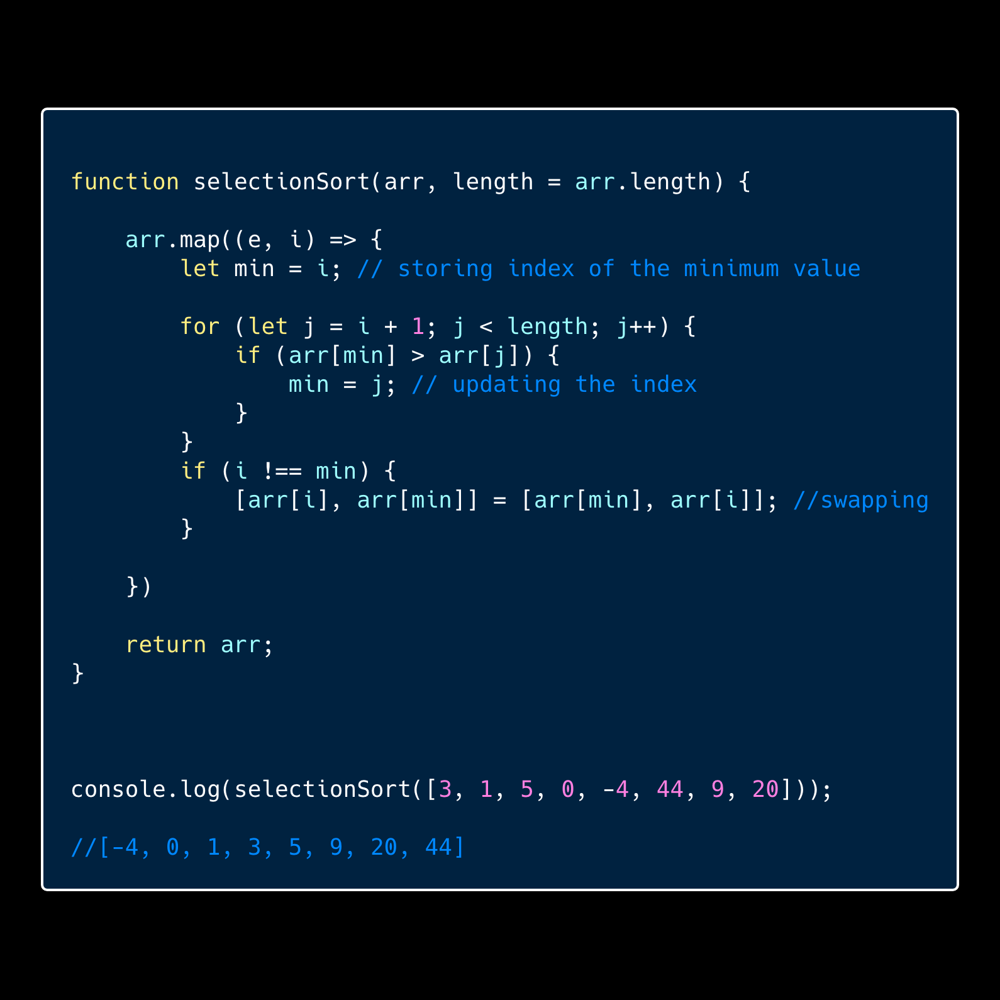

In this tutorial, we will learn about selection sort algorithm and its implementation in JavaScript.

## What is Selection sort?

Selection sort is a sorting algorithm with O(n<sup>2</sup>) time complexity.It performs very slow on larger datasets.


### How does selection sort works?

Selection sort starts with choosing a minimum element and compares it against the unsorted array.

#### Example:


1.)  [ 4,3,5,2 ]

- selection sort chooses 4 as the minimum element and starts comparing it against the remaining part of the array if any element which is smaller than 4 then we need to swap it.


2.)  [ 2,3,5,4 ].

- After swapping now it chooses 3 as a minimum element and starts comparing with remaining part of the array there is no element which is smaller than 3 so we move to next element which is 5.

-  Now 5 is a minimum element but we find the element 4 which is smaller than  5 so we swap it.

final sorted array [ 2,3,4,5 ]


### Algorithm implementation

So far you have got some knowledge about how selection sort works, so Let's implement the selection sort algorithm now.

```js
function selectionSort(arr){

  return arr
}
```

Now we need to use two for loops one is for choosing the minimum element and the second one is comparing it against the remaining part of the unsorted array and updates the minimum element.


```js
function selectionSort(arr) {

    for (var i = 0; i < arr.length; i++) {

        let min = i; //  storing the index of minimum element

        for (var j = i + 1; j < arr.length; j++) {
            if (arr[min] > arr[j]) {
                min = j; // updating the index of minimum element
            }
        }
    }
    return arr
}
```

The final step we need to swap.

```js
function selectionSort(arr) {

    for (var i = 0; i < arr.length; i++) {

        let min = i; //  storing the index of minimum element

        for (var j = i + 1; j < arr.length; j++) {
            if (arr[min] > arr[ j ]) {
                min = j; // updating the index of minimum element
            }
        }

        if (i !== min) {
            let temp = arr[ i ];
            arr[ i ] = arr[min];
            arr[min] = temp;
        }
    }
    return arr
}
```

You can even use array destructing for swapping the elements.

```js
function selectionSort(arr) {

    for (var i = 0; i < arr.length; i++) {

        let min = i; //  storing the index of minimum element

        for (var j = i + 1; j < arr.length; j++) {
            if (arr[min] > arr[j]) {
                min = j; // updating the index of minimum element
            }
        }

        if (i !== min) {
            [arr[ i ],arr[min]]= [arr[min],arr[ i ]];
        }
    }
    return arr
}

console.log(selectionSort([ 4,3,5,2 ])) // [2,3,4,5]
```

### Second way of implementation using the JavaScript map method



---

