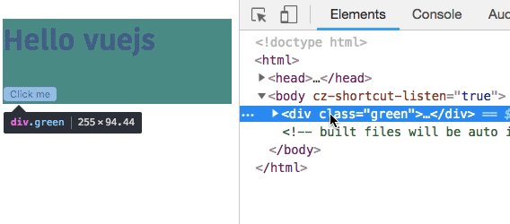

In this tutorial, we are going to learn about how to dynamically add and remove class names, inline styles in vuejs.


## Class Bindings

Vue.js offers us a `v-bind:class` directive to dynamically add and remove classes based on a particular condition.


> In this tutorial we are using the shorthand syntax of `v-bind:class` is `:class`

Let's see an example.

Currently, we are using the `object syntax` to bind the class names dynamically.

```html{3,13,20-23}
<template>
 <!-- <div :class="{className:propertyName}"> -->
 <div :class="{red:isActive}">
   <h1>Hello vuejs</h1>
   <button @click="isActive=!isActive">Click me</button>
 </div>
</template>

<script>
 export default{
     data:function(){
         return{
             isActive:false
         }
     }
 }
</script>

<style>
  .red{
      background-color:red;
  }
</style>
```

In the above code, we added `:class="{red:isActive}"` to our `div` tag, it means we are telling the vuejs please add `red` class to a `div` tag if `isActive` data property is `true`.


__Array syntax__

Currently, we are adding our `red` class if `isActive` property is true, sometimes we need to add the other class name if `isActive` property is false in such cases we need to use `Array syntax` inside the quotes.

```html{4}
<template>
             <!-- array syntax -->
 <!-- <div :class="[propertyName?'className':'className']"> -->
 <div :class="[isActive?'red':'green']">
   <h1>Hello vuejs</h1>
   <button @click="isActive=!isActive">Click me</button>
 </div>
</template>

<script>
 export default{
     data:function(){
         return{
             isActive:false
         }
     }
 }
</script>

<style>
  .red{
      background-color:red;
  }
  .green{
      background-color:green;
  }
</style>
```



Here we adding the `red` class if `isActive` property is true otherwise we are adding the `green` class.

## Inline style Bindings

We can also bind the inline styles in Vue by using the `:style` directive.

example:

```html{4,6-7}
<template>
  <!-- object syntax -->
  <!-- <div :style="{'css-propertyName':properyName}"> -->
  <div :style="{ 'background-color': color }">
    <h1>Hello vuejs</h1>
    <button @click="color = 'red';">Change to Red color</button>
    <button @click="color = 'green';">Change to Green color</button>
  </div>
</template>

<script>
export default {
  data: function() {
    return {
      color: ""
    };
  }
};
</script>
```

Here we added a `:style="{ 'background-color': color }"` to our `div` tag so that if we click on a `Change to Red color` button our background color is changing to red and if we click on a `Change to Green color` button our background color is changing to `green`.