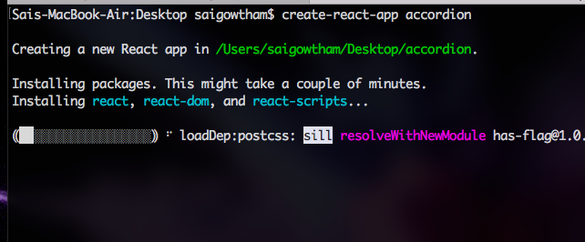
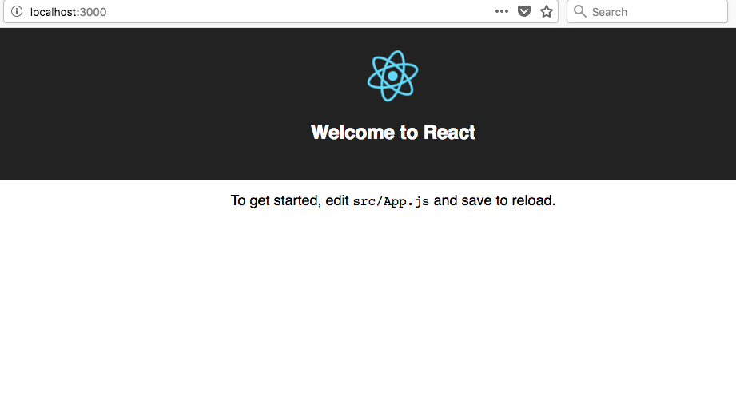
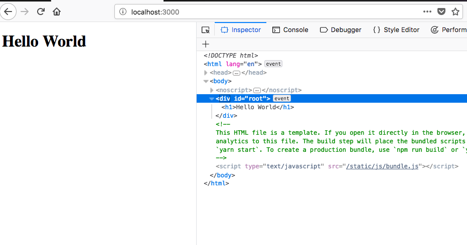

## Create react app

To set up the dev environment we need to install the package called create-react-app
which is used to generate the new react app with zero configuration it already follows the best practices.

it is also created by the facebook to overcome the confusion of setting up the babel and webpack etc.

Let's install the create-react-app package globally.

Open your terminal and run following commands

```bash
npm install -g create-react-app
```

once you successfully installed it's time to create a new react app using create-react-app.

Now in your terminal run following commands.

```bash
create-react-app accordion
```




This above command installs the required packages for the app in the accordion folder.

```bash
cd accordion
npm start
```

npm start command is used to start the local development server.




now open the accordion folder in your favorite code editor.

Project structure might look like this.


```bash
├── node_modules
├── package.json
├── .gitignore
├── public
│   ├── favicon.ico
│   ├── index.html
│   └── manifest.json
└── src
|   ├── App.css
|   ├── App.js
|   ├── App.test.js
|   ├── index.css
|   ├── index.js
|   ├── logo.svg
|   └── registerServiceWorker.js
|--- README.md

```

**node_modules**: If you install any new packages using npm it will go into the node_modules folder.

**package.json**: In package.json you will see the installed packages list.

**gitignore**: It means what files you need to ignore at the time of upload on GitHub.

**src**: we mainly used the src folder where the main app lives.

Open your src folder and delete everything because we are writing from scratch.

We are using the import and exports syntax which is available  in the es6 let me explain you briefly what is import and export


### Default imports and exports

if you put export statement before the  function name that function is imported using the import statement

```js
function add(n1,n2){
    return n1+n2
}
export default add;
```

```js
import add from './add.js'

console.log(add(1,2)) // output 3
```

These are called default imports.

### Named imports and exports

```js
function add(n1,n2){
    return n1+n2
}
export {add};
```

```js
import {add} from './add.js'

console.log(add(1,2)) // output 3
```

create an index.js file in the src folder and write the below code.

```javascript
import React from 'react';
import ReactDOM from 'react-dom';

function Helloworld() {
    return <h1>Hello World</h1>
}

ReactDOM.render(<Helloworld/>,document.getElementById('root'))
```

1. First, we imported the React and ReactDOM packages from the node_modules.

2. Next, we created a  function which is returning the h1 element.

3. ReactDOM.render takes the two arguments which are
   - which elements need to render in the dom.
   - where to render in the dom.


If you inspect in your browser



Have you seen in the above image h1 element is rendered inside the div element with the id root?