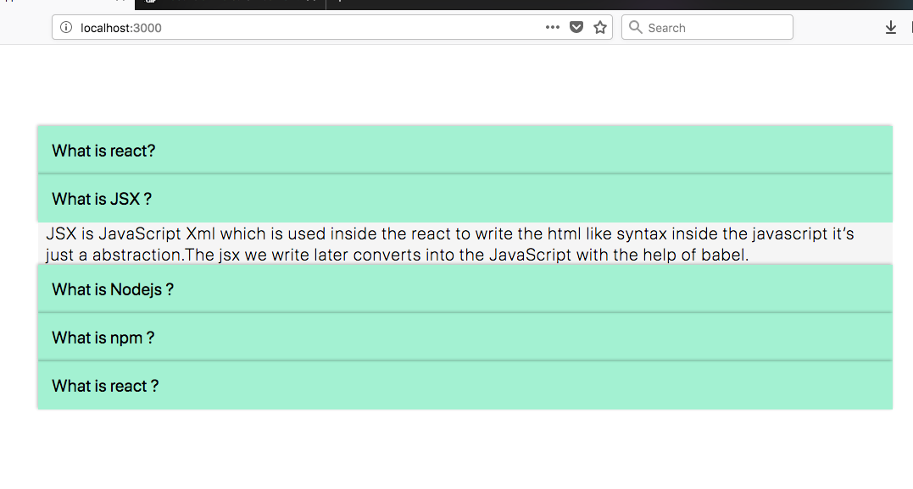

So far we didn't add any styles to our app now it's time to add some styles
so it feels and looks good.

create an app.css file in your src folder and add the following styles.

*app.css*

```css
* {
  margin: 0;
  padding: 0;
  box-sizing: border-box;
}
.accordion {
  margin-top: 6rem;
  font-size: 20px;
  width: 100%;
}

.holder {
  list-style: none;
  width: 70%;
  margin: 0 auto;
  font-family: -apple-system, BlinkMacSystemFont, "Segoe UI", Roboto, Oxygen,
    Ubuntu, Cantarell, "Open Sans", "Helvetica Neue", sans-serif;
}

.question {
  background: #00d7825c;
  padding: 1rem;
  box-shadow: -1px -1px 3px 0px #1a1a1a4f;
  cursor: pointer;
  font-weight: 400;
}

.answer {
  overflow: hidden;
  padding: 0 0.6rem;
  background: whitesmoke;
  font-weight: 200;
  letter-spacing: 1px;
}

```

In react we need to import the CSS just like how we imported js.


open *app.js* file

```javascript
import React from "react";
import qa from "./qa";
import List from "./list";
import './app.css'

class Accordion extends React.Component {
  state = {
    currentIndex: -1,
  };

  handleChange = i => {
    this.setState({
      currentIndex: i
    });
  };

  render() {
    const { handleChange } = this;
    const { currentIndex, isActive } = this.state;

    return (
      <div className="accordion">
        {qa.map(function(e, i) {
          return (
            <List
              question={e.question}
              answer={e.answer}
              handleChange={handleChange}
              key={i}
              index={i}
              currentIndex={currentIndex}
            />
          );
        })}
      </div>
    );
  }
}

export default Accordion;
```
We need to use a className attribute instead of the class attribute in react.

Now open you list.js file

```javascript
import React from "react";

function List(props) {
  return (
    <ul className="holder">
      <li
        className="question"
        onClick={() => props.handleChange(props.index)}>{props.question}</li>
      {props.currentIndex === props.index &&
        <li className="answer">{props.answer}</li>}
    </ul>
  );
}
export default List;
```

It might look like this after adding styles.



## Animation

But still, something is missing which is animation.

Open your app.css and add the below code.

```css
.answer {
  overflow: hidden;
  transition: all 0.3s ease-out;
  transform: translateY(-11%);
  opacity: 0.7;
  padding: 0 0.6rem;
  background: whitesmoke;
  font-weight: 200;
  letter-spacing: 1px;
}
.answer.open {
  opacity: 1;
  padding: 1rem;
  transform: translateY(0);
}
```

### How to add and remove styles conditionally in react?

Open list.js file we need to do a little bit of code refactoring.we are taking the help of ternary operator what it does is it only adds the open className when the current variable is true.

```javascript
import React from "react";

function List(props) {
  let current = props.currentIndex === props.index;

  return (
    <ul className="holder">
      <li className="question" onClick={() => props.handleChange(props.index)}>
        {props.question}
      </li>
      <li className={current ? "answer open" : "answer"}>
        {current && <p>{props.answer}</p>}
      </li>
    </ul>
  );
}

export default List;
```

Congratulations You successfully created your first react app.


[Accordion url](https://saigowthamr.github.io/reactaccordion/)

[Code repository](https://github.com/saigowthamr/reactaccordion)