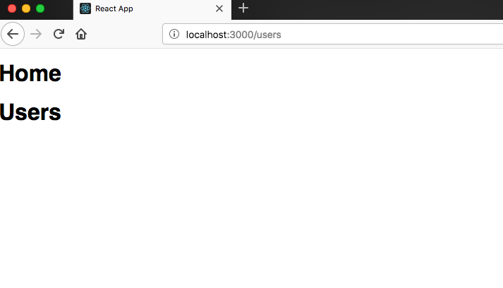

open index.js file and import the three components we created in the last tutorial

_index.js_

```javascript
import React from 'react'
import ReactDOM from 'react-dom'
import './index.css'
import App from './App'
import Users from './users'
import Contact from './contact'

ReactDOM.render(<App />, document.getElementById('root'))
```

React router gives us three components which help us to implement the routing.

_index.js_

```javascript
import React from 'react'
import ReactDOM from 'react-dom'
import { Route, Link, BrowserRouter as Router } from 'react-router-dom'
import './index.css'
import App from './App'
import Users from './users'
import Contact from './contact'

ReactDOM.render(<App />, document.getElementById('root'))
```

Let's implement the routing.

In the Route component, we need to pass the two props

- path: it means we need to specify the path.
- component: which component user needs to see when they will navigate to that path.

```javascript
import React from 'react'
import ReactDOM from 'react-dom'
import './index.css'
import { Route, Link, BrowserRouter as Router } from 'react-router-dom'
import App from './App'
import Users from './users'
import Contact from './contact'

const routing = (
  <Router>
    <div>
      <Route path="/" component={App} />
      <Route path="/users" component={Users} />
      <Route path="/contact" component={Contact} />
    </div>
  </Router>
)

ReactDOM.render(routing, document.getElementById('root'))
```

Now if you enter manually localhost:3000/users you will see Users component is rendered.



But still, Home component is also rendered in the screen this happens because of our home path is ’/’ and users path is ‘/users’ **slash** is same in both paths so that it renders the both components to stop this behavior we need to use the exact prop.

```javascript
import React from 'react'
import ReactDOM from 'react-dom'
import './index.css'
import { Route, Link, BrowserRouter as Router } from 'react-router-dom'
import App from './App'
import Users from './users'
import Contact from './contact'

const routing = (
  <Router>
    <div>
      <Route exact path="/" component={App} />
      <Route path="/users" component={Users} />
      <Route path="/contact" component={Contact} />
    </div>
  </Router>
)

ReactDOM.render(routing, document.getElementById('root'))
```

Now if you see only users are rendered on the screen.

### Adding Navigation using Link component

_index.js_

```javascript
import React from 'react'
import ReactDOM from 'react-dom'
import './index.css'
import { Route, Link, BrowserRouter as Router } from 'react-router-dom'
import App from './App'
import Users from './users'
import Contact from './contact'

const routing = (
  <Router>
    <div>
      <ul>
        <li>
          <Link to="/">Home</Link>
        </li>
        <li>
          <Link to="/users">Users</Link>
        </li>
        <li>
          <Link to="/contact">Contact</Link>
        </li>
      </ul>
      <Route exact path="/" component={App} />
      <Route path="/users" component={Users} />
      <Route path="/contact" component={Contact} />
    </div>
  </Router>
)

ReactDOM.render(routing, document.getElementById('root'))
```

After adding navigation you will see the routes are rendered on the screen. if you click on the users you will see url is changing and Users component is rendered.


